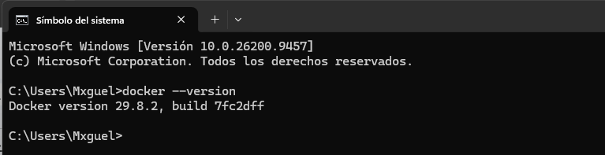
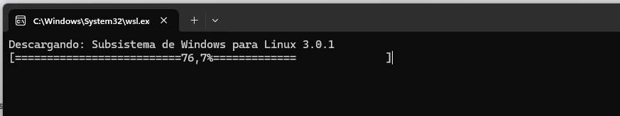
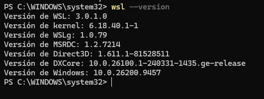
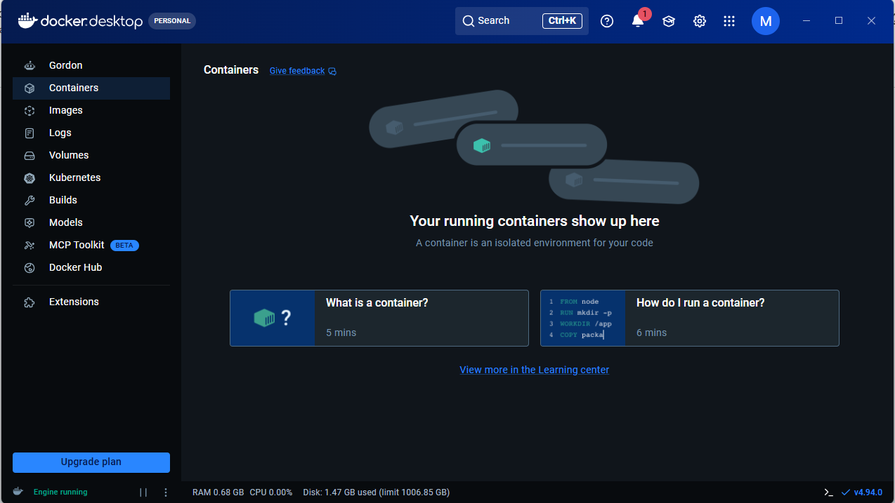
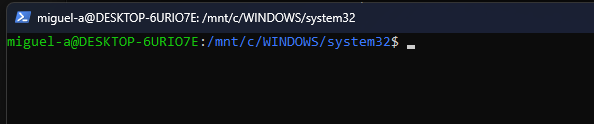
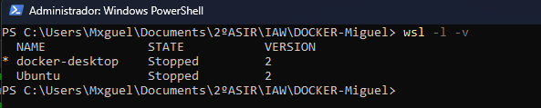
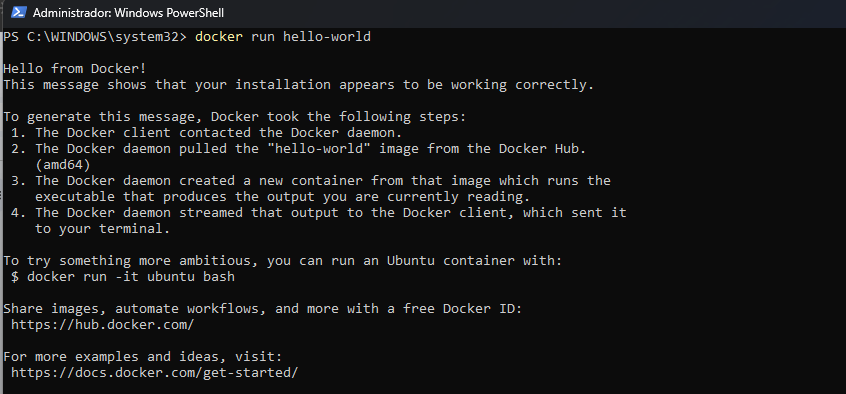

# Instalación-DOCKER

# Instalación y configuración de Docker

## 1. Comprobamos que Docker está instalado correctamente

## 2. Creamos nuestra cuenta en Docker Hub

## 3. Instalamos WSL para utilizarlo con Docker

## 4. Nos conectamos a Docker Desktop

## 5. Iniciamos sesión con nuestro usuario

## 6. Comprobamos que las versiones son correctas

## 7. Comprobamos el funcionamiento con `hello-world`

